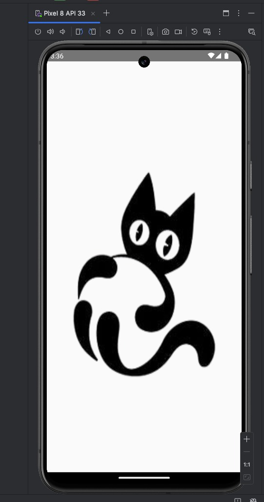
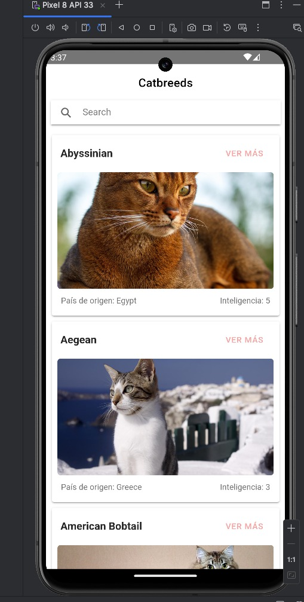
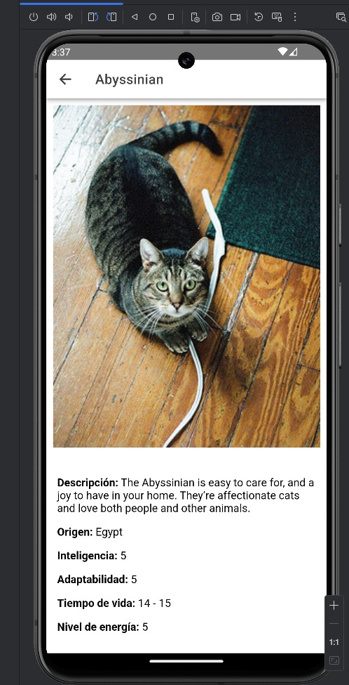

# 📝 Prueba Técnica - Ionic & Angular

## 📌 Introducción
Este proyecto es una prueba técnica desarrollada con **Ionic 8** y **Angular 19**. Implementa una aplicación para mostrar información sobre gatos, obtenida de una API, utilizando buenas prácticas en desarrollo de software.

## 🛠 Tecnologías usadas
- **Ionic 8**
- **Angular 19**
- **Node.js v20.9.0**
- **TypeScript**
- **Jasmine & Karma** (para pruebas unitarias)
- **Android Studio** (para pruebas en dispositivo/emulador)
- **HTTPClient** (para consumir APIs)
- **Capacitor** (para configurar el splash screen)

## 🚀 Instalación y ejecución
### 1️⃣ Clonar el repositorio
```sh
git clone https://github.com/Duvier-Reinosa/thecatapp.git
cd thecatapp
```

### 2️⃣ Instalar dependencias
```sh
npm install
```

### 3️⃣ Ejecutar la aplicación
```sh
ionic serve
```

*Asegúrate de tener Android Studio instalado y configurado.*

## 📂 Estructura del Proyecto
```
├── src
│   ├── app
│   │   ├── pages
│   │   │   ├── cat
│   │   │   │   ├── cat.page.ts  # Lógica de la página
│   │   │   │   ├── cat.page.html  # Vista de la página
│   │   │   │   ├── cat.page.spec.ts  # Pruebas unitarias
│   │   ├── services
│   │   │   ├── cats.service.ts  # Servicio para obtener datos
```

## 📌 Casos de Uso
- ✅ Visualización de lista de razas.
- ✅ Filtrar por medio del buscador.
- ✅ Visualización de información detallada sobre una raza de gato.
- ✅ Manejo de errores cuando no se encuentra la raza.
- ✅ Carga de imágenes de la API.

## 🧪 Cómo ejecutar las pruebas
### Pruebas unitarias (Jasmine/Karma)
```sh
npm run test
```
### Pruebas en Android Studio
Para ver las pruebas realizadas en Android Studio tengo las siguientes imágenes:

### 📸 Capturas de pruebas en Android Studio





